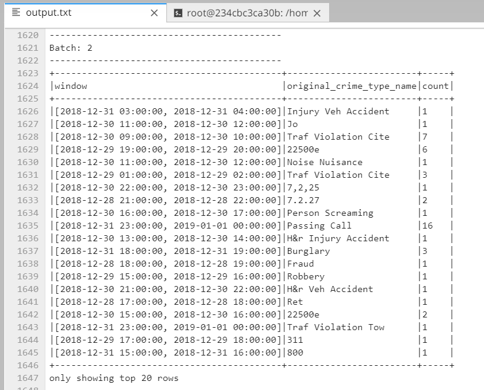

# SF Crime Statistics with Spark and Kafka Streaming Integration


## Overview

In this project, you will be provided with a real-world dataset, extracted from Kaggle, on San Francisco crime incidents, and you will provide statistical analyses of the data using Apache Spark Structured Streaming. You will draw on the skills and knowledge you've learned in this course to create a Kafka server to produce data, and ingest data through Spark Structured Streaming.

### Development Environment

-   Spark 2.4.3
-   Scala 2.11.x
-   Java 1.8.x
-   Kafka build with Scala 2.11.x
-   Python 3.6.x or 3.7.x

#### Environment Setup

##### For Macs or Linux:

-   Download Spark from  [https://spark.apache.org/downloads.html](https://spark.apache.org/downloads.html). Choose "Prebuilt for Apache Hadoop 2.7 and later."
-   Unpack Spark in one of your folders (I usually put all my dev requirements in /home/users/user/dev).
-   Download binary for Kafka from this location  [https://kafka.apache.org/downloads](https://kafka.apache.org/downloads), with Scala 2.11, version 2.3.0. Unzip in your local directory where you unzipped your Spark binary as well. Exploring the Kafka folder, you’ll see the scripts to execute in  `bin`  folders, and config files under  `config`  folder. You’ll need to modify  `zookeeper.properties`  and  `server.properties`.
-   Download Scala from the official site, or for Mac users, you can also use  `brew install scala`, but make sure you download version 2.11.x.
-   Run below to verify correct versions:
    
    ```
    java -version
    scala -version
    
    ```
    
-   Make sure your ~/.bash_profile looks like below (might be different depending on your directory):
    
    ```
    export SPARK_HOME=/Users/dev/spark-2.4.3-bin-hadoop2.7
    export JAVA_HOME=/Library/Java/JavaVirtualMachines/jdk1.8.0_181.jdk/Contents/Home
    export SCALA_HOME=/usr/local/scala/
    export PATH=$JAVA_HOME/bin:$SPARK_HOME/bin:$SCALA_HOME/bin:$PATH
    
    ```
    

##### For Windows:

Please follow the directions found in this helpful StackOverflow post:  [https://stackoverflow.com/questions/25481325/how-to-set-up-spark-on-windows](https://stackoverflow.com/questions/25481325/how-to-set-up-spark-on-windows)

## Project Files

You can find the following files in the project repository:

-   `producer_server.py` - contains class for reading data from input file and sending out messages to Kafka topic.
-   `kafka_server.py` - runs Kafka server and generate data to Kafka topic by importing class from *producer_server.py*
-   `data_stream.py` - create and cun Spark Streaming application in Standalone mode.
-   `police-department-calls-for-service.json` - contains the JSON logs from police department calls.
-   `radio_code.json` - contains criminal disposition codes and description.
-   `start.sh` - for installing required packages.
-   `requirements.txt` - the list of required packages.

The following command should be written to check if your  `kafka_server.py`  is working properly:

	>> kafka-console-consumer --topic "topic-name" --from-beginning --bootstrap-server localhost:9092


## How to run the project

The following are the steps to get the project running:

1. Install requirements using the provided `./start.sh` script.

2. Start Zookeeper:

`/usr/bin/zookeeper-server-start config/zookeeper.properties`

3.  Start Kafka server:

`/usr/bin/kafka-server-start config/server.properties`

4. Run Kafka Producer server:

`python kafka_server.py`

5.  Run Kafka Consumer:

`kafka-console-consumer --topic "topic-name" --from-beginning --bootstrap-server localhost:9092`

**Kafka Consumer Console Output Screenshot:**


6.  Run Spark Streaming Job:

`spark-submit --packages org.apache.spark:spark-sql-kafka-0-10_2.11:2.3.4 --master local[*] data_stream.py > output.txt`

**Progress Reporter Screenshot:**


**Spark Streaming Output:**



## Performance Tuning Questions

**1.  How did changing values on the SparkSession property parameters affect the throughput and latency of the data?**
    
Changing the values of the Spark Session property parameters affect the latency and throughput of the data. This behavior can be observed by noticing the value of ***processedRowsPerSecond*** (the number of rows processed per second by Spark streaming job), this processing rate gives us the indication of data throughput. The higher the number, the higher the throughput, and vice versa. 
    
Also, ***inputRowsPerSecond*** and ***numInputRows*** gives an indication how much input data in kafka are ready to be processed by Spark streaming job. If the spark streaming is started after most of the input data was ready in kafka topic and spark is set to consume data from earliest. This causes, the ***numInputRows*** and ***processedRowsPerSecond*** to be higher in the beginning. But in few batches the Spark catches up to the Kafta producer speed, if the ***maxOffsetsPerTrigger*** is value large enough. In the long run stable condition, ***processedRowsPerSecond** should not be less than ***inputRowsPerSecond***. 
    
**2.  What were the 2-3 most efficient SparkSession property key/value pairs? Through testing multiple variations on values, how can you tell these were the most optimal?**

The following SparkSession property parameters are most effective in optimizing the value of ***processedRowsPerSecond***. 

***- maxOffsetsPerTrigger***: 48000 (Rate limit on maximum number of offsets processed per trigger interval)

***- spark.default.parallelism***: 48 (total number of cores on all executor nodes)

***- spark.sql.shuffle.partitions***: 10 (number of partitions needed for shuffling data for joins or aggregations)

***- spark.streaming.kafka.maxRatePerPartition***: 1000 (maximum rate at which data is read from each Kafka partition)
    
